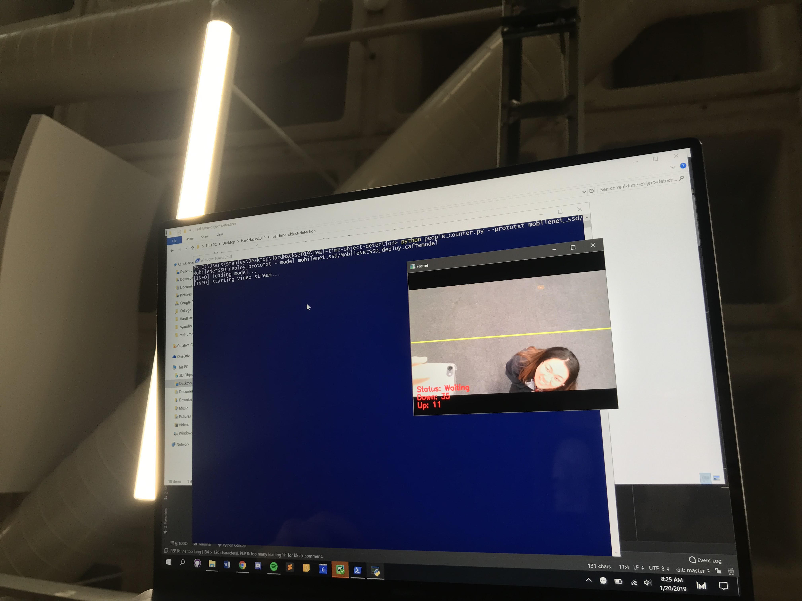

# NOGGIN LOGIN - HardHacks2019
Noggin Login is a program and hardware hack that counts the heads, or __noggins__, of people in a selected area.

DEMO: https://youtu.be/m5ggC2xEji4

DEVPOST: https://devpost.com/software/hardhacks2019

# Motivation/Applications
As first-time college students, we were shocked by the sheer size of lecture halls and class sizes. However, it quickly became apparent that class attendance varies on a day to day basis, with a noticeable decrease as a quarter comes to a close. We realized that collecting data of the amount of students in a lecture hall would be quite useful, including for:
- Studying possible correlations of class attendance with average grades/passing rates
- Studying trends of class attendance and how they correlate with certain events/the _nth_ week of a quarter
- Monitoring class attendance against the amount of seats for adjusting waitlists

The hack isn't just limited to the classroom; Noggin Login could be used in any public area that could use some head-counting to determine how many people visit the space over time!

# Different Versions
Two different implementations are available for noggin-counting!

## Implementation A - Above the Lecture Hall
- The device can be installed on the ceiling in the middle of a room to continuously count from above the amount of heads in the selected area. As shown below, a colored frame appears around each detected person. The program then sums up the amount of detected people.

Implementation A Demo - Two humans are detected.

## Implementation B - Above the Door
- The device can be installed just above the front door of a room to count how many people walk in and out. The line dividing the screen represents the programmed boundary of the room. Depending on which side the line was crossed from by a person, the integer representing the number of people in the room will increment/decrement.

Implementation B Demo Pic 1 - The "Down" counter (in red, at the bottom left corner of the camera window) is 34.

Implementation B Demo Pic 2 - After a person crossed the boundary, the "Down" counter is 35.

Implementation B Demo Pic 3 - How the "door" boundary was emulated.

# Installation
- Clone the repository
- Install pip, OpenCV, imutils, and pySerial
- Download the Arduino IDE and connect Arduino as displayed by given imagers
- python real_time_object_detection_Sravya.py --prototxt MobileNetSSD_deploy.prototxt.txt --model MobileNetSSD_deploy.caffemodel (Run in terminal, python or python3 depending on your system)

# Features
- Head counter that adds up the total amount of people in a room
- Website that displays the live count of people
- Arduino with an LCD displaying the live count of people

Setup of Arduino

Arduino Closeup

Welcome Sign at start of running program

Initiating message before displaying count

Final total head count: 5 (Our team members here!)

Potentiometer used as a giant 3-way resistor

# Challenges
- Connecting the Python data of head counts to display on the LCD attached to the Arduino
- Figuring out the correct algorithm to increment and decrement the amount of people that is detected
- Understanding the functions of an Arduino

# Extensions
- Printing out the number of people onto the LCD
- Website that would potentially broadcast a live count of the people in a room
- __Text to speech__ was also successfully programmed using Google Cloud; however, there was not enough time to implement functionality with the actual head-counting.

# Credits
- CodePen.io
  
  -- https://codepen.io/harmputman/pen/ImjDs
  
  -- https://codepen.io/neoberg/pen/kavnF

- OpenCV
  
  -- https://github.com/C-Aniruddh/realtime_object_recognition
  
- Arduino
  
  -- https://www.arduino.cc/reference/en/language/functions/communication/serial/
  
